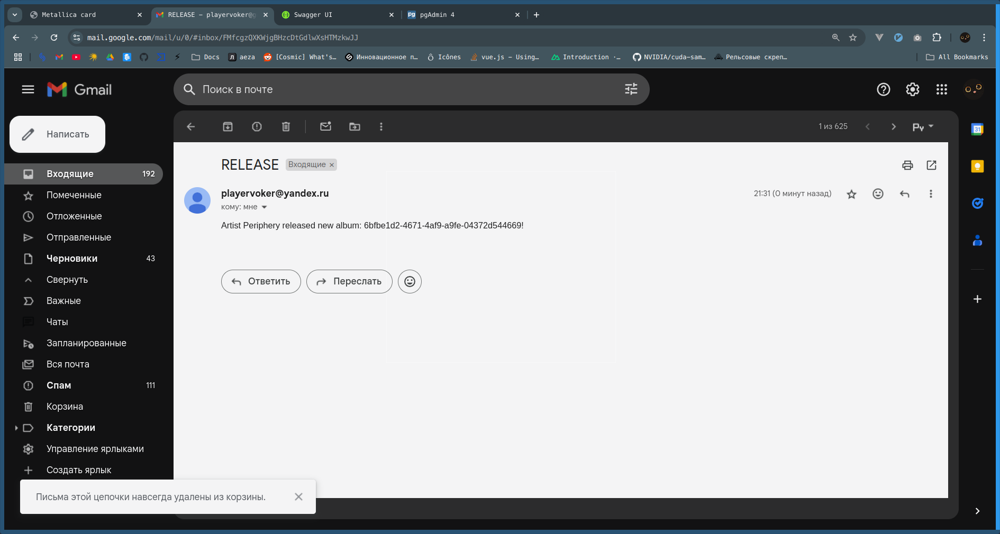
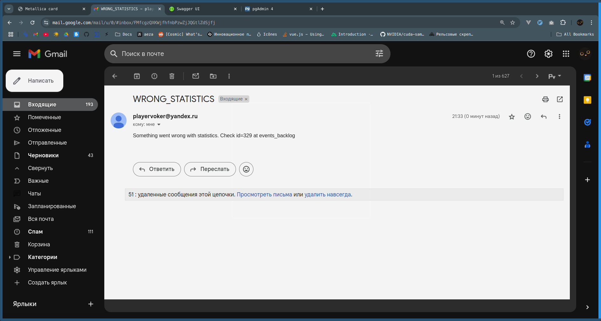
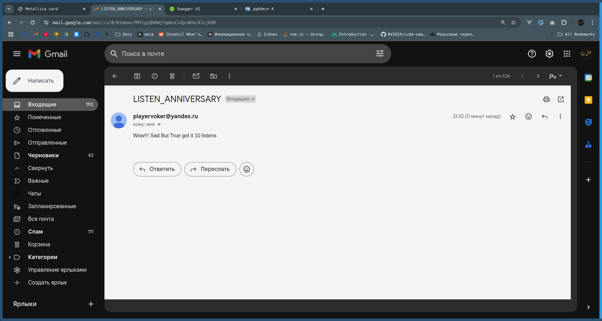

# Report

## События

Реализовано 3 вида событий
1. Выход альбома - когда у артиста выходит альбом им будет приходить уведомление
2. Неправильная статистика - пригодится для администраторов, если по ошибке данные обновеления сломают существующую статистику (или в целом метаинформацию о сущности)
3. "Юбилей прослушиваний" (колличество прослушиваний, которые делятся без остатка на 10) - плюс мотивация начинающим артистам, так как они смогут увидеть свою возрастающую популярность) 

## Письмо при выходе альбома

## Письмо при неправильном изменении статистики

## Письмо при юбилее

# Practical Work #4

Java Message Service

## General task

You are to add some new functionality to the previous application, namely a logging mechanism and a “watchdog” for a specific kind of changes.

Logging should provide a simple mechanism to put information on changes in your system into a special table of the database.

“Watchdog” should send e-mail notifications on specific changes in the system to some specified e-mail addresses.

It is strongly recommended to use version control and source code management system (like GitHub).

It is strongly recommended to use Maven to manage your project.

You can choose any IDE, but IntelliJ IDEA is recommended.

## Task 1

Add new table to your database. Each row should represent a change of information in other tables of your database. A row should contain information on a kind of a change (insert, update, etc.), on a changing entity (e.g. its class, id) and on a substance of a change (e.g. new values for fields).

## Task 2

Create and configure JMS administrative objects in your application server. Choose type of destination object wisely.

## Task 3

Change your application to make it send a message to the destination object every time some changes are applied to entities. Choose message type and structure reasonably.

## Task 4

Develop MDB or MDP (depending on your technology platform) to receive these messages. Then MDB or MDP should check message's type and structure, and then make a record into the dedicated table.

## Task 5

Choose a type of events you want to make notifications for. It can be changes of exact entity, changes of entities with names containing some specific string, some entity attribute exceeding some boundaries, etc. Specify additional information required to identify such an event (e.g. entity id, specific string, attribute boundaries, etc.).
Add new table to the database. Each row should contain an e-mail for notification and condition information.

## Task 6

Develop MDB or MDP to receive messages on changes, check conditions and send e-mails.

Some additional class may be required.

## Task 7

Make everything work together…
